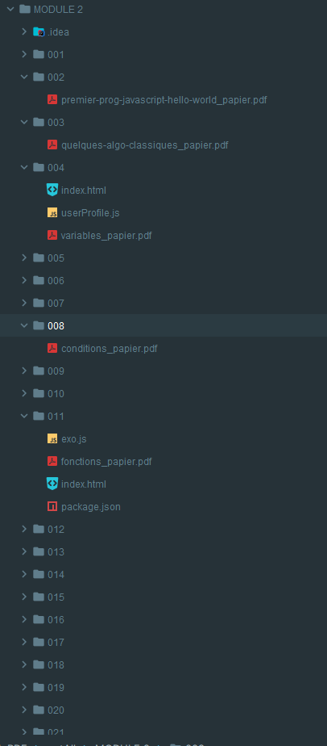
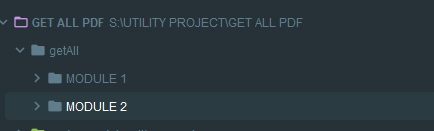
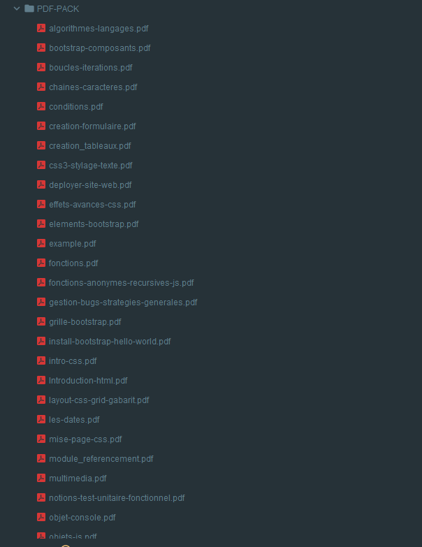

# Récupération de fichiers PDF

Ce projet est un script JavaScript qui récupère tous les fichiers PDF dans plusieurs sous-dossiers, puis les copie dans un dossier à la racine du projet. Il utilise la bibliothèque Node.js `fs` pour interagir avec le système de fichiers.

## Installation

1. Clonez le dépôt Git sur votre machine locale.

2. Assurez-vous que Node.js est installé sur votre machine. Si ce n'est pas le cas, vous pouvez télécharger Node.js sur leur site web: https://nodejs.org/.

3. Ouvrez un terminal ou une invite de commandes dans le dossier racine du projet, puis exécutez la commande suivante pour installer les dépendances:

## Utilisation

1. Ouvrez un terminal ou une invite de commandes dans le dossier racine du projet.

2. Exécutez la commande suivante pour lancer le script: `npm run getpdf
   `

3. Le script va parcourir tous les sous-dossiers de `getAll`, copier tous les fichiers PDF dans un nouveau dossier nommé `PDF-PACK` à la racine du projet, puis renommer chaque fichier pour retirer le suffixe "_papier" s'il est présent.

4. Une fois le script terminé, vous devriez voir un message s'afficher dans le terminal indiquant que la récupération des fichiers PDF est terminée.

## Configuration
Vous pouvez ajouter des dossiers à ignorer en les ajoutant au tableau `dossiersAignorer` dans le fichier `index.js`.

## Dépendances

- [Node.js](https://nodejs.org/) - environnement d'exécution JavaScript
- [fs](https://nodejs.org/api/fs.html) - bibliothèque Node.js pour interagir avec le système de fichiers
- [path](https://nodejs.org/api/path.html) - bibliothèque Node.js pour manipuler les chemins de fichiers et de dossiers

## Auteur

[Neo](https://github.com/Neogetsu/)

## Licence

Ce projet est sous licence MIT - voir le fichier [LICENSE](LICENSE) pour plus de détails.

## Illustration:

### Example: 

### Copier dans get All

### Resultat 

